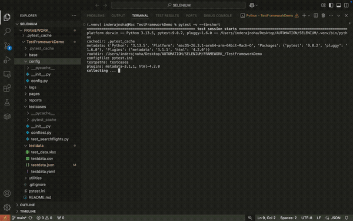

# 🛫 Selenium POM DDT Automation Framework


A production-grade, end-to-end test automation framework built with **Python + Selenium WebDriver + pytest**, validating flight stop-count filters on a live travel booking website.

---

## 🎬 Demo



---

## 🏗 Framework Architecture

```
selenium-pom-ddt-framework/
├── base/               # BaseDriver — shared WebDriver utilities (waits, scroll)
├── config/             # Centralised config (URLs, timeouts, file paths)
├── pages/              # Page Object classes (one class per page)
├── testcases/          # pytest test classes + conftest fixtures
├── testdata/           # CSV / JSON / YAML / Excel test data files
├── utilities/          # Logger factory, data readers, soft-assert helpers
├── reports/            # Auto-generated HTML reports + failure screenshots
├── logs/               # Auto-generated daily log files
├── pytest.ini          # pytest configuration
├── requirements.txt    # Project dependencies
└── README.md
```

---

## 🧠 Design Patterns & Concepts Applied

| Concept | Implementation |
|---|---|
| **Page Object Model (POM)** | Each page is a separate class in `pages/` — locators and actions fully encapsulated |
| **Data-Driven Testing (DDT)** | Tests driven by external `testdata.json` — zero code change to add new test cases |
| **Soft Assertions** | All results checked before raising — full failure report, not fail-fast |
| **Explicit Waits** | `WebDriverWait` throughout — zero hardcoded waits for element interactions |
| **Inheritance** | Page classes inherit `BaseDriver` — shared utilities without duplication |
| **Fixtures** | pytest `conftest.py` handles browser setup/teardown cleanly per test |
| **Custom Logger** | Timestamped log files, console + file output, named by caller |
| **Centralised Config** | All paths, URLs, timeouts in one file — zero hardcoding across the framework |
| **JS Click Fallback** | Safe click helper scrolls element into view, falls back to JS click if intercepted |

---

## ✅ What Is Tested

**Test:** `test_flight_stop_filter`

| Step | Action |
|---|---|
| 1 | Navigate to travel booking website and dismiss popup |
| 2 | Enter departure and destination cities from test data |
| 3 | Select departure and return dates |
| 4 | Submit flight search |
| 5 | Apply stop-count filter (0 / 1 / 2 stops) |
| 6 | Scroll to load all paginated results |
| 7 | Soft-assert every result card matches the selected filter |

---

## 📊 Test Data — Easily Extendable

Tests are driven by `testdata/testdata.json`. Add a new row to add a new test — no code changes needed:

```json
[
    {
      "going_from": "New Delhi",
      "going_to": "Melbourne",
      "depart_date": "April 4th",
      "return_date": "April 8th",
      "stops": "1 Stop"
    }
]
```

The framework also supports **CSV**, **Excel**, and **YAML** as data sources — just swap the reader in `utils.py`.

---

## 📋 Sample Log Output

```
2026-04-03 01:26:20  [INFO]  Starting flight search | New → MEL | April 4th to April 8th
2026-04-03 01:26:46  [INFO]  Filter '1 Stop' applied successfully
2026-04-03 01:27:12  [INFO]  Total result rows found: 130
2026-04-03 01:27:12  [INFO]  Asserting 130 result(s) all show '1 Stop'
2026-04-03 01:27:12  [INFO]  Assertion summary — PASS: 130 | FAIL: 0
```

---

## 🚀 Quick Start

### 1. Clone the repo
```bash
git clone https://github.com/InderParmar/selenium-pom-ddt-framework.git
cd selenium-pom-ddt-framework
```

### 2. Create a virtual environment
```bash
python -m venv .venv
source .venv/bin/activate        # Mac/Linux
.venv\Scripts\activate           # Windows
```

### 3. Install dependencies
```bash
pip install -r requirements.txt
```

### 4. Run all tests
```bash
pytest -v --tb=short
```

### 5. Run a specific test
```bash
pytest -v --tb=short -k "MEL"
```

### 6. Run on a specific browser
```bash
pytest --browser=chrome
pytest --browser=safari
```

### 7. View the HTML report
```bash
open reports/test_report.html     # Mac
start reports/test_report.html    # Windows
```

---

## 🛠 Tech Stack

| Tool | Version | Purpose |
|---|---|---|
| Python | 3.13 | Core language |
| Selenium WebDriver | 4.x | Browser automation |
| pytest | 9.x | Test runner and fixture management |
| pytest-html | 4.x | HTML report with embedded screenshots |
| DDT | 1.7 | Data-driven test decoration |
| softest | 1.1 | Soft assertion support |
| openpyxl | 3.1 | Excel data reader |

---

## 📁 Key Files Explained

**`base/base_driver.py`** — Parent class for all page objects. Contains reusable WebDriver methods like explicit waits and infinite scroll.

**`config/config.py`** — Single source of truth for all URLs, file paths, and timeout values. Nothing is hardcoded anywhere else.

**`pages/yatra_launch_page.py`** — Page Object for the homepage. Handles the full search form flow including city selection and date picking.

**`pages/search_flights_results_page.py`** — Page Object for the results page. Handles filter clicks with safe JS fallback and result element retrieval.

**`utilities/utils.py`** — Logger factory (timestamped daily log files), data readers (JSON/CSV/Excel/YAML), and soft assertion helper that checks all elements before raising failures.

**`testcases/conftest.py`** — pytest fixtures for browser init/teardown, automatic failure screenshot capture, and HTML report hooks.

---

## 📌 Author

**Inderpreet Singh Parmar**
[GitHub](https://github.com/InderParmar) · [LinkedIn](https://linkedin.com/in/yourprofile)
